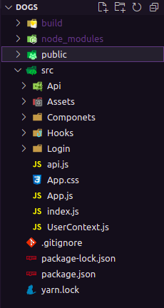

#
### O que é o Dogs?
 Dogs é uma aplicação ReactJS desenvolvida durante o curso "React Completo" da plataforma Origamid. O projeto é uma rede social para cachorros, 
 permitindo com que o usuário poste fotos do seu pet. 
 
 ### Quais são as funcionalidades do site?
 * Criar conta;
 * Fazer login;
 * Postar fotos;
 * Ver estatísticas;
 * Postar comentários;
 * Recuperar conta;
 * Deletar foto.
 
#### Como o projeto está estruturado?

#### Quais as tecnologias utilizadas no desenvolvimento?
O projeto foi quase totalmente desenvolvido em ReactJs com Css, foi usado apenas uma biblioteca externa que é a **Victory**.

#

### Você pode acessar aqui: [dogs](https://dogs-origamid-zeta.vercel.app/)
